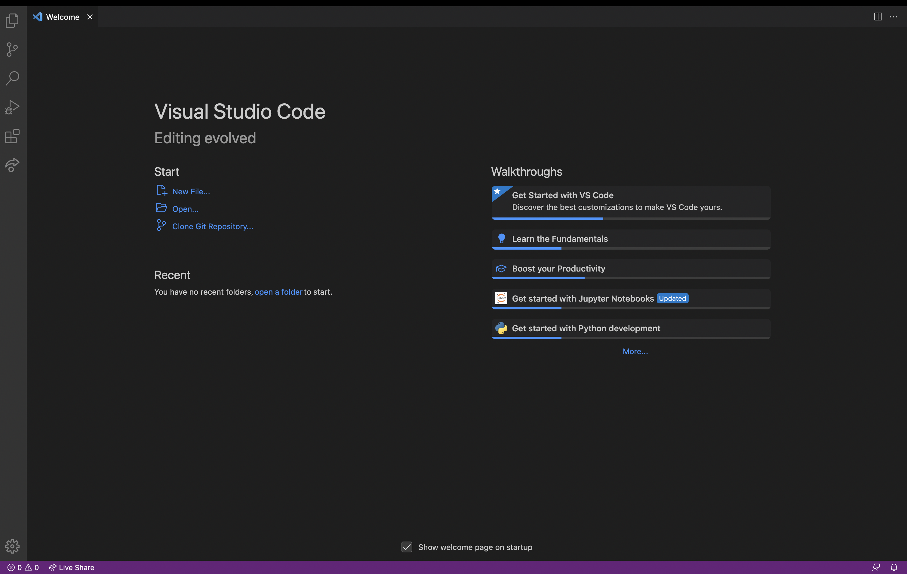
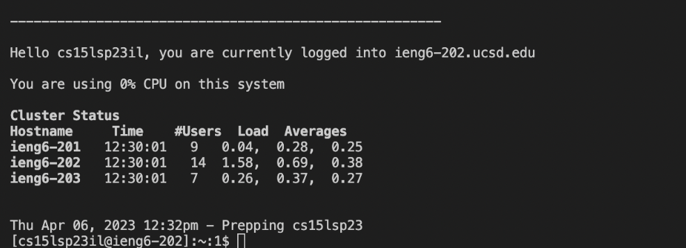
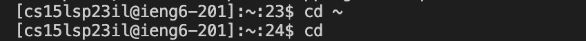
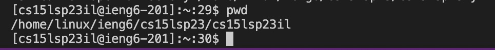
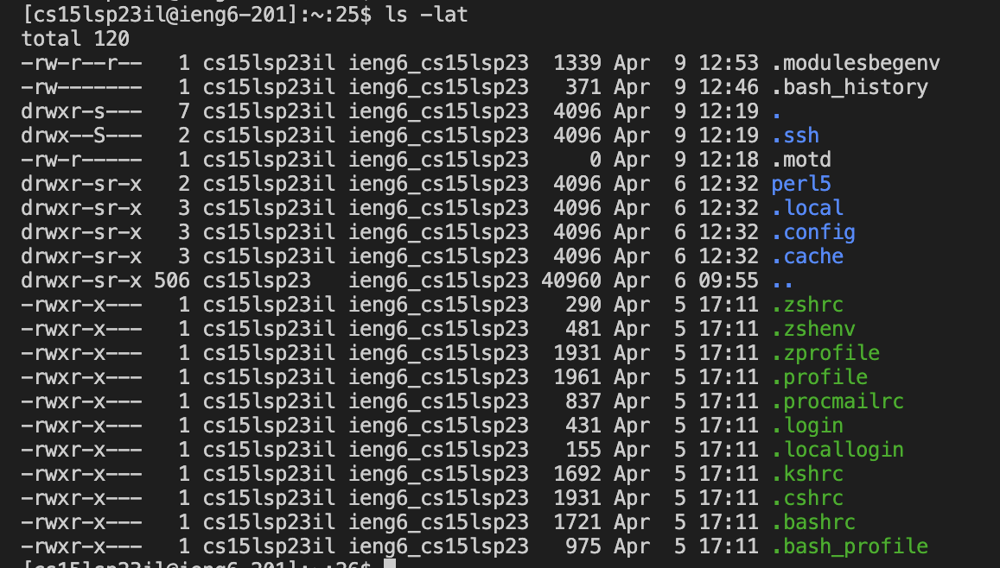

# Lab Report #1: Remote Access and FileSystem 

Beginning to remote access and figuring out how to login into a course-specific 
account can seem quite troublesome. However, that can now easily be resolved through 
these simple steps!

## VScode Installation 

**First, VScode must be installed onto the computer.** 
* I did not complete this specific step exactly, as prior to the lab, VScode had
already been installed.

**Once VScode is installed, when the application is open, it should open to this:**

   
## Remote Connection 

**Before remote connection:**
1) Look up specific-course account for CSE15L here: https://sdacs.ucsd.edu/~icc/index.php
2) Login. Then, click on the course for CSE15L. It typically starts with: cs15l. 
3) Next, use the Global Password Change Tool to reset your password. This will be important\
   for the remote connection as well as the shown username. 
4) Remember your password and username for remote connection. 

**To Remote Connect:**
1) Open VScode. Then open the terminal using the command: ctrl + ` 
2) Now that the terminal is open, type in ssh **username**@ieng6.ucsd.edu
3) If entered correctly, the next line would ask a question whether
    to continue connecting. Type in: yes . 
4) Then, enter your password that you've reset your account to 
   * Note: When typed in the terminal it won't show up because it is invisible.
5) When the password has been inputted correctly, the terminal should show: 
    

   
    

   
   
## Running Some Commands 
**Now that you've successfully remotely connected, run some commands.**

**cd Command:**

>

The cd command is meant to switch what is the current directory to a specified path. 

**pwd Command:**
 
 >
 
 Here the pwd command prints out what is the current working directory. 
 
 
**ls -lat Command:**
  
  >
  
  This command results in a list of the files in the current working directory as shown above. 
 
