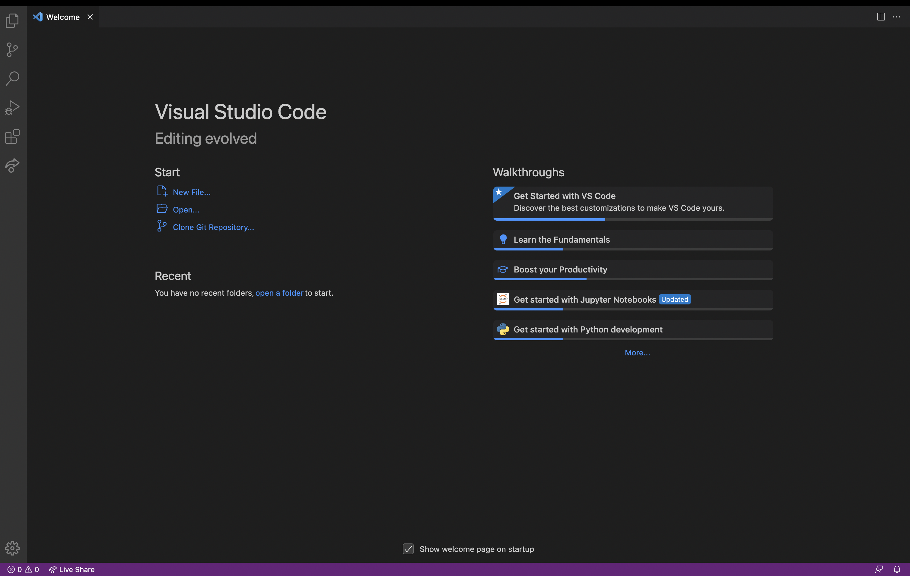

# Lab Report #1: Remote Access and FileSystem 

Beginning to remote access and figuring out how to login into a course-specific 
account can seem quite troublesome. However, that can now easily be resolved through 
these simple steps!

## VScode Installation 

**First, VScode must be installed onto the computer.** 
* I did not complete this specific step exactly, as prior to the lab, VScode had
already been installed.

**Once VScode is installed, when the application is open, it should open to this:**

