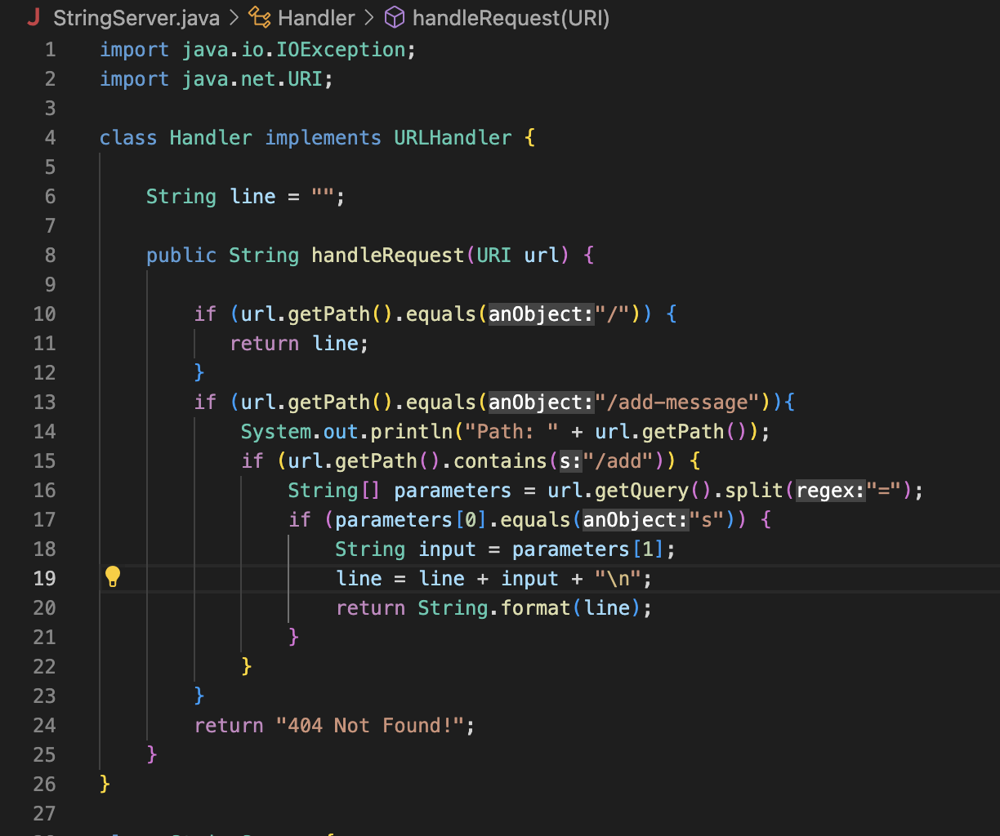
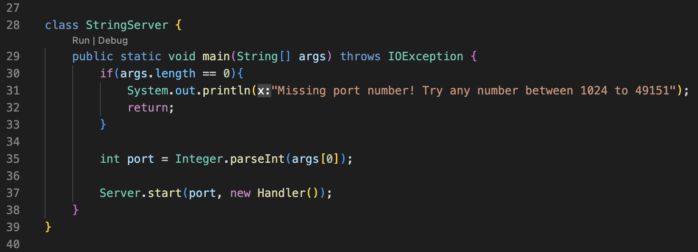
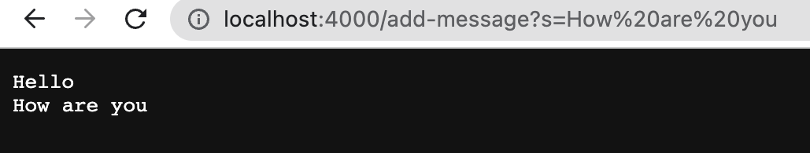
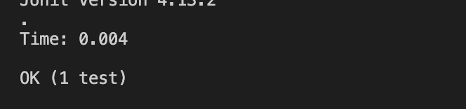

# Lab Report #2: Servers and Bugs 
This lab report will discuss the web server, String Server, and address bugs within a code. 


## Web Server - String Server 
A server is made where it will print out the string inputted into the path. 

**String Server Code** 

- Handler Class 
   > 
  
  <br>
  
  
- String Server Class 
   > 

**Results**

- Image #1
  > 
  
  - The methods in this code are called 'handleRequest' and main.
     - handleRequest: This method takes the query and splits the string from the '=' and returns the      string onto the page. The argument passed in Image #1 is 'Hello'.
     - main: The main method checks whether the argument, the port number, is a valid argument in order to create the domain. The port number here is 4000. 
  - Passing the argument 'Hello' only results in the page turning from a blank page to the result in Image #1 as no argument has been passed prior. 

<br>


- Image #2
  > 

   - The methods in this code are called 'handleRequest' and main.
      - handleRequest: This method takes the query and splits the string from the '=' and returns the      string onto the page. The argument passed in   Image #2 is 'How are you'.
     - main: The main method checks whether the argument, the port number, is a valid argument in order to create the domain. The port number here is 4000. 
   - Passing the argument 'How are you' results in the page adding a second line of 'How are you' because outside the method the instance variable "line" is set. And within the method, in the second "if statement" on line 19, essentially adds onto the current argument to the previous. 


## Bugs: from Array Methods
The Array Methods are intended to reverse a list, however, because of bugs in the code it 
does not output the expected results. <br>


**The Bug**  
There is a bug specifically in the "reverseInPlace" method that incorrectly changes the input array to be in reversed order: 
The bug would correctly reverse the first half of the list, but in the second half retains the same values rather than the reversed values.

```
  static void reverseInPlace(int[] arr) {
    for(int i = 0; i < arr.length; i += 1) {
      arr[i] = arr[arr.length - i - 1];
    }
  }
 ```
<br>


**Input & Symptom** - The symptom, as the output of running the tests (provide it as a screenshot of running JUnit with at least the two inputs above)
- Test 1 
  - Failure Inducing Input

  ```
  @Test 
  public void testReverseInPlace2(){
    int[] input1 = {1,2,3,4,5};
    ArrayExamples.reverseInPlace(input1);
    assertArrayEquals(new int[]{5,4,3,2,1}, input1);
  }
  ```
      
      
  - Symptom 
     

 The input {1,2,3,4,5} is meant to be reversed into {5,4,3,2,1}. However, this test fails because of bug only reverses the first half of the list successfully. But starting at index 3, the element values stay the same as it is expected to be 2. In actuality, the result is 4. 

<br>


- Test 2 
  - Non-Failure Inducing Input
  
  ```
    @Test 
  public void testReverseInPlace3(){
    int[] input1 = {3,3,3};
    ArrayExamples.reverseInPlace(input1);
    assertArrayEquals(new int[]{3,3,3}, input1);
  }
  ```
  - Symptom
  
     

 The input {3,3,3} is reversed into {3,3,3}. This test passes as opposed to Test 1 because the values stay the same. As such, the order of reversing does  not necessarily matter at which index and element. Thus, this test successfully passes. 

<br>


**Addressing the Bug**
In order to fix the bug and get the desired outcome, the code is then altered to: 

```
  static void reverseInPlace(int[] arr) {
    for(int i = 0; i < arr.length/2; i += 1) {
      int temp = arr[i]; 
      arr[i] = arr[arr.length - i - 1];
      arr[arr.length - i - 1] = temp; 
```

- Essentially rather than loop the entire list, it is better to loop through half of it. In doing so, you don't swap the elements twice.  

- Then create a temporary variable. This is meant to store arr[i] values. 
- Setting arr[i] to arr[arr.length - i - 1] reverses the first half of the list. 
- Setting arr[arr.length - i - 1] to temp reverses the second half or "swaps". 

By altering the code to iterating to half the list length and setting a temporary variable, the bug is then resolved since it 
will no longer set the second half of the list to the non-reversed elements. Rather, the list elements at their indices will now be "swapped". 
For instance, list {1,2,3,4,5} will now correctly swap/reverse to {5,4,3,2,1}. 

<br>


## What I've Learned 

- In lab 2, I learned that the query in a URL can be passed as an argument to return/print on a screen. For example, returning a string from the query or incrementing and adding the increments. Furthermore, learned about the format() method and its importance in formatting how we want the query argument to be printed on the screen. 

- In lab 3, I learned that certain tests can "pass" buggy code, and that edge cases are best to catch the bugs in the code. Moreover, print statements are useful in pinpointing the issue in the code in order to debug. 
