# Lab Report #4: Vim Command Line Task 
This lab report will be a step-by-step process of forking a repository, cloning the repository, 
and using VIM to edit and save the file. 

## Step 1: Setup - Delete any existing forks of the repository you have on your account
  
  1) Go into your GitHub account and into the repository.
  <br>
   
   
  2) Go to the repository's settings. 
     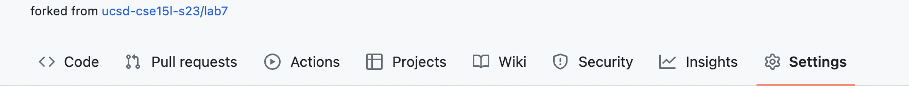
  
  
  3) Scroll all the way down and click on the button 'Delete this repository'. 
     This will delete any exiting forks of the repository. 
     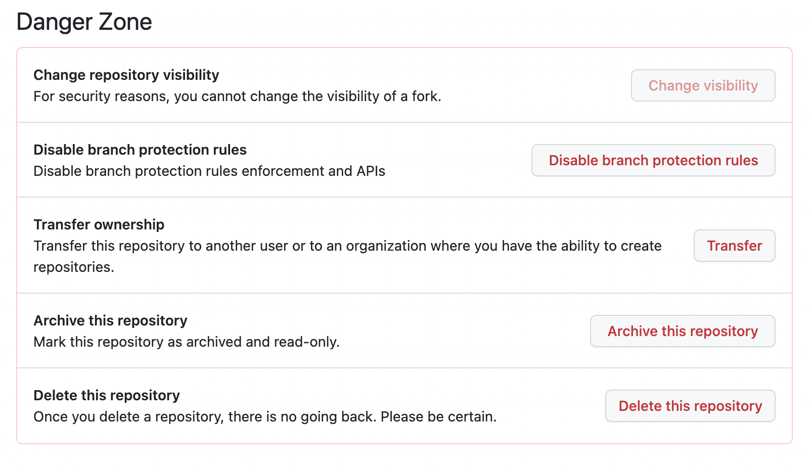
  
  
  4) Additionally, log into the @ieng6 account. Then use the command **rm -r lab7/** to remove the directory
     from the account in order to follow the next steps. When this is completed, log out of the account. 
     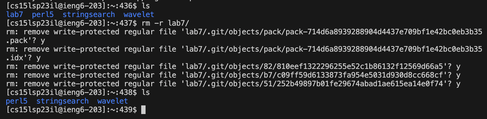

 
  <br>


## Step 2: Setup - Fork the repository

  1) Follow this [link](https://github.com/ucsd-cse15l-s23/lab7) to fork Lab 7's repository. 
     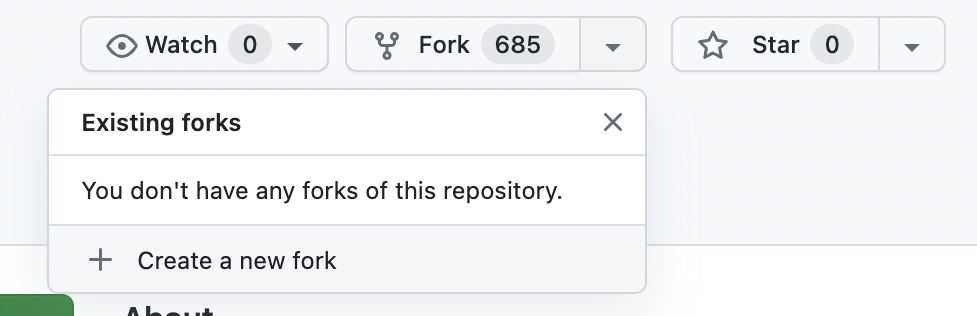
<br>


## Step 3: Start the timer!

  1) Begin a timer to determine your baseline in logging in, cloning, and editing the code. <br>


## Step 4: Log into ieng6

  1) Use the command: **ssh cs15lsp23__@ieng6.ucsd.edu** to remote login. With ssh you can remote login to your 
     account in order to begin the cloning process of the repository. <br>
  
  
   ```
   ssh cs15lsp23il@ieng6.ucsd.edu
   ```
 

## Step 5: Clone your fork of the repository from your Github account
  1) Use the command: **git clone < ssh link >** to clone the repository from your GitHub account into 
     your ieng6 account. <br>
     
   
   ```
    git clone git@github.com:a-nguy4n/lab7.git
   ```
     
  2) Use the command **ls** to check if the repository has been cloned into the account. 
     The directory name **lab7** should be listed. 
      
   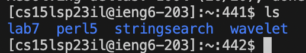
     
     
   *If the name of directory is shown in the output, cloning is a success!*

  3) Then, use the command **cd** to get into the repository and access its files. <br>


   ```
   cd lab7/
   ```
     

  4) Once the directory has changed into that repository, use command **ls** to see the files inside. 
     By doing this, you can gain access to the files in order to follow the next steps to test and edit. 
     
   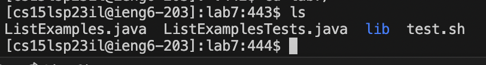 
     
  <br>


## Step 6: Run the tests, demonstrating that they fail
  1) To run a test use the command: **bash test.sh** . 
  - **Input:** <br>


  ```
  bash test.sh
  ```
   <br>
   
   
   - **Output:** <br>
     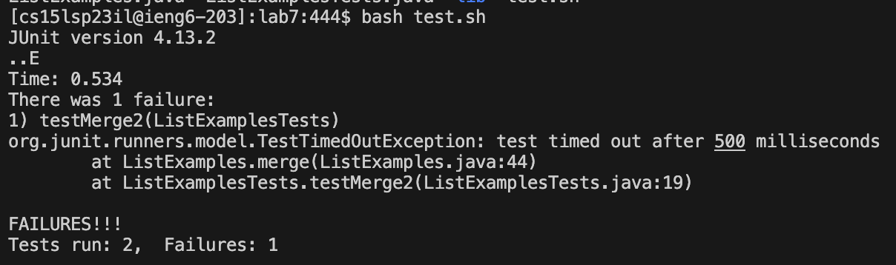
 
 
 - The command **bash test.sh** essentially will run tests on the 'ListExamples.java' file through JUnit and 
   will output either a pass or fail on the test cases. If there is a pass, then it will state how many tests have been run
   and passed. However if there is a failure, the output will show how many and list which line specifically where the test has
   failed and the reasoning.
   <br>

    
    
## Step 7: Edit the code file to fix the failing test
  
  1) To edit the code of the file, use the command: **vim ListExamples.java**. After running the command,it 
     will open up to the contents of the file containing code that must be edited.
     
  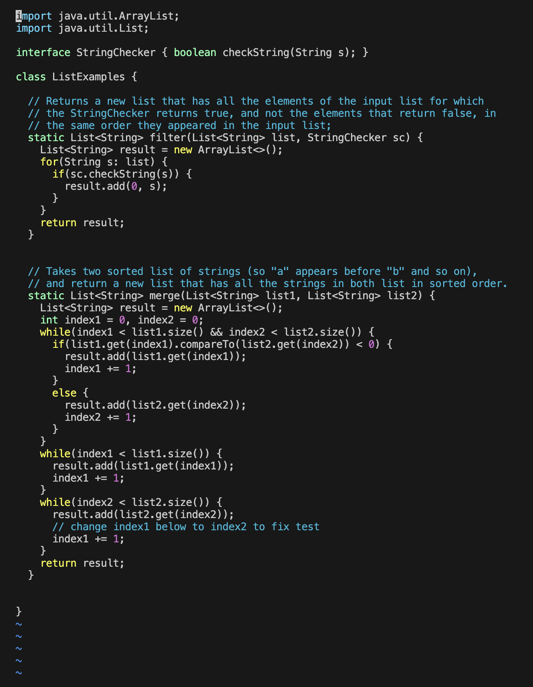
  
  2) Next follow these steps in order to edit the code:
 
      1. Starting from the beginning line, hit the key j until you reach these code lines:
        
      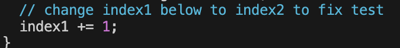
       
        - The j key essentially moves the cursor downwards so that the user may access the lines below in order to edit them. 
      
      2. With the cursor on the line of ' index1 += 1; ' hit the L key to move the cursor onto the number 1.
        
      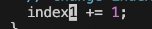
     
        - The L key moves the cursor to the right so that the user may access and edit any text to the right side. 
   
      3. Press the keys in this order:
      
        - i : User will enter into "Insertion Mode" which allows them to edit the text
                
        - < backspace >: By backspacing, user will not delete the wrong character for the necessary edit.
             
        - < delete >: This should delete the number 1 from index1.
             
        - <2> : Typing in '2' will edit index1 to index2. This is the correction being made.
             
        - < escape > : Once done editing, the < escape > key allows user to leave "Insertion Mode" and back into "Normal Mode"
            
        
         
  **The results:**
  - Before 
    
    

  - After
    
    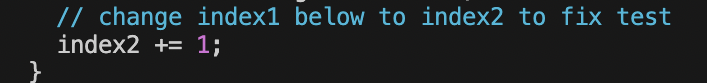
          
<br>


## Step 8: Run the tests, demonstrating that they now succeed.

  1) Before running the tests, it is important to save the edited file. 
     Type in the following: <br>
     
     
   - **:wq**  
     - This will essentially save the file with the new edits made. 
  <br>


   - **< return >**
     - Runs the command and exists the file and brings the user back to the command line.
   <br>
     
     
  2) To run the tests use the command: **bash test.sh** . This command will run tests on the newly edited 'ListExamples.java' file 
     through JUnit. And now all test cases have passed! 
     <br>  
     
     
  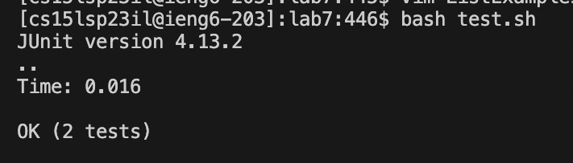
     
<br>
    


## Step 9: Commit and push the resulting change to your Github account (you can pick any commit message!)

  1) First in the command line type: 
  <br>


  ```
  git add ListExamples.java
  ``` 
  
   - This command adds the newly edited file into the repository. <br>
     
     
  2) Secondly, type in: 
  <br>
  
  
   ```
   git commit -m "index changed"
   ```
   
  - This command will commit the edited file with a message. **-m** is the command to add a message using **""**. 
     In the block code, the message choosen was "index changed" to summarize the edits made. 
       
  - The output after pressing < enter > to the command is: 
  
  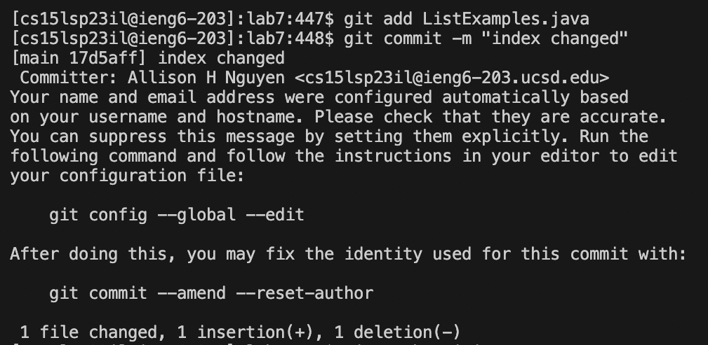
  
  
  
  
  3) Finally, type in: 
  <br>
  
  
  ```
  git push origin
  ```
     
  - The command will now push the edits into the forked repository with the updates. 

  - The output after pressing < enter > to the command is: <br>
       
       
  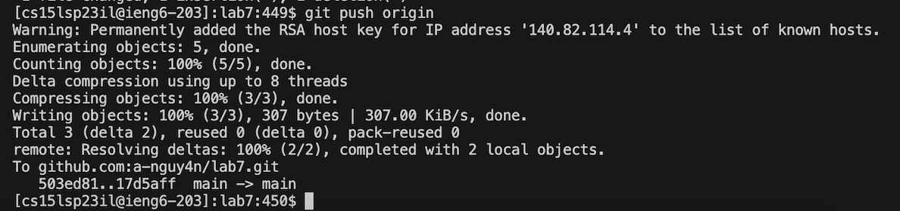


