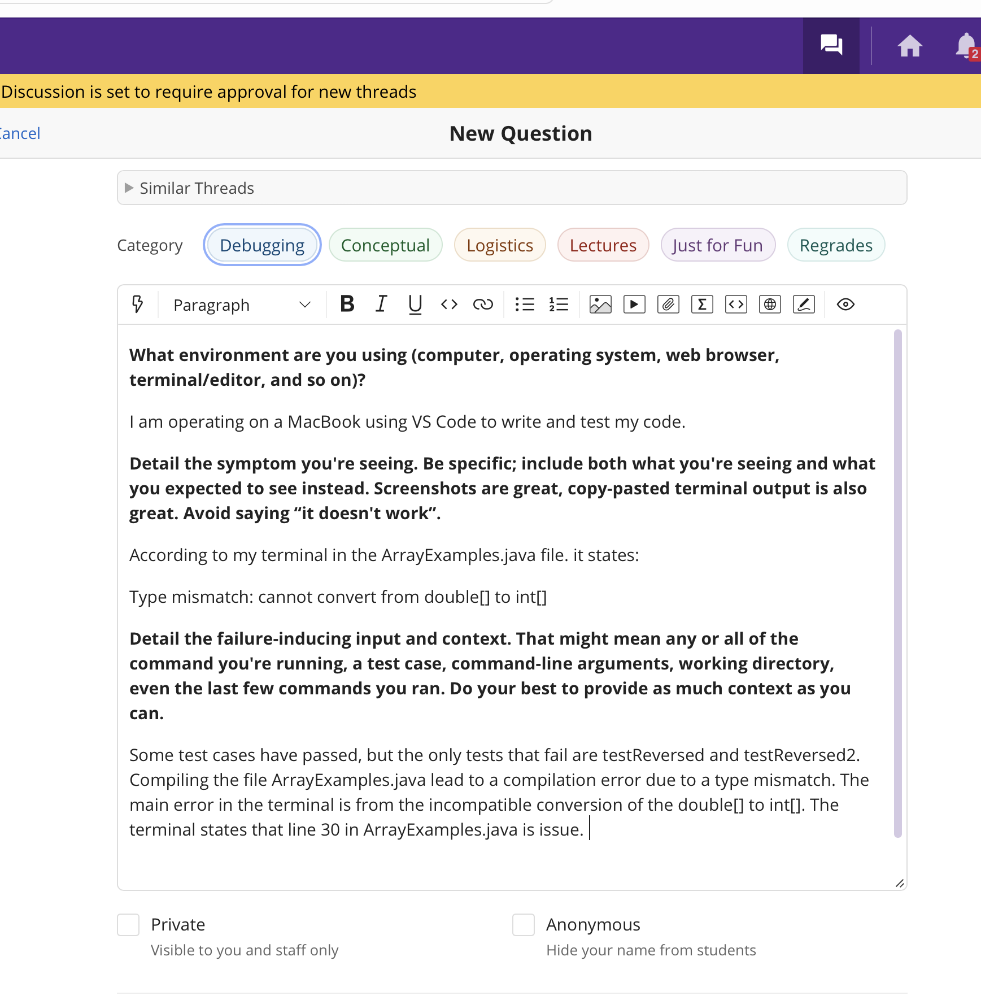
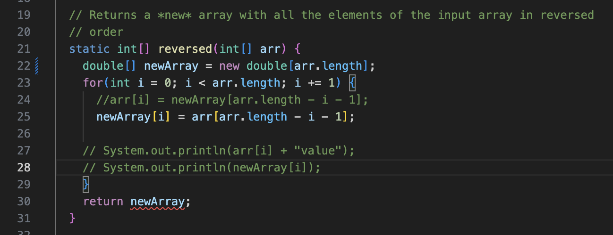
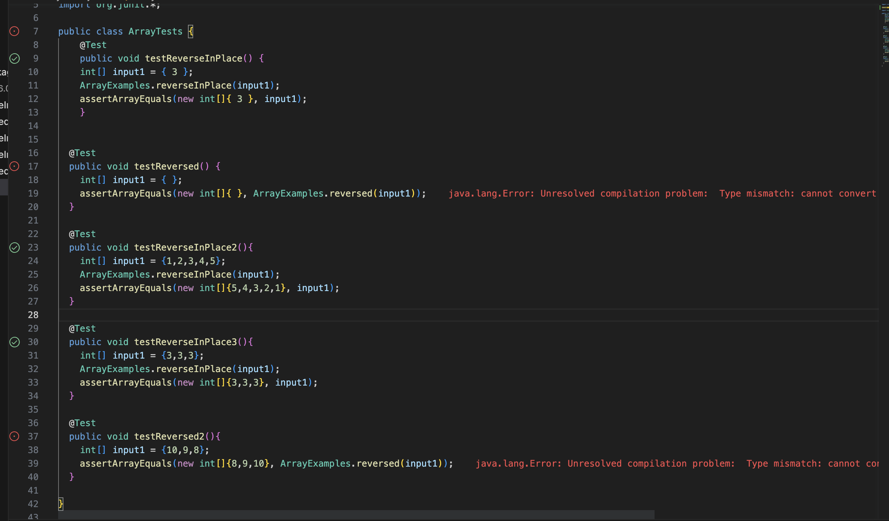
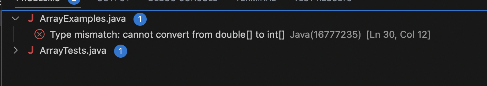
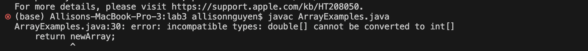
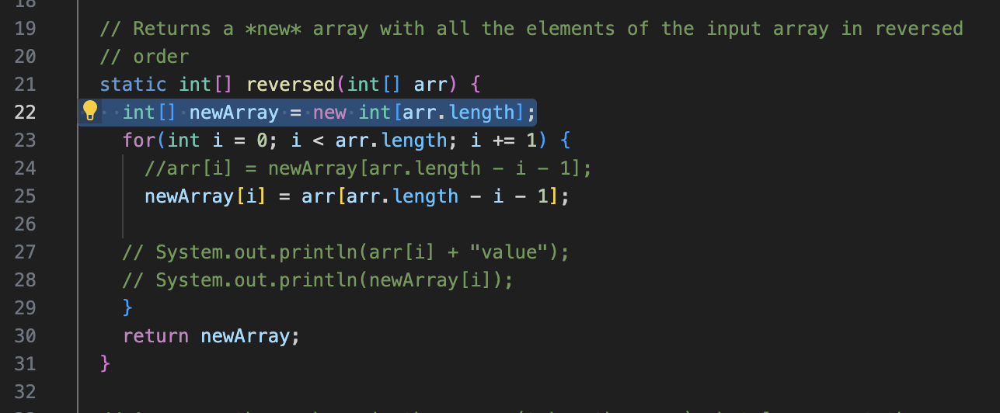
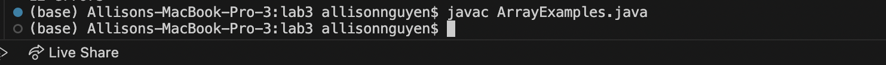
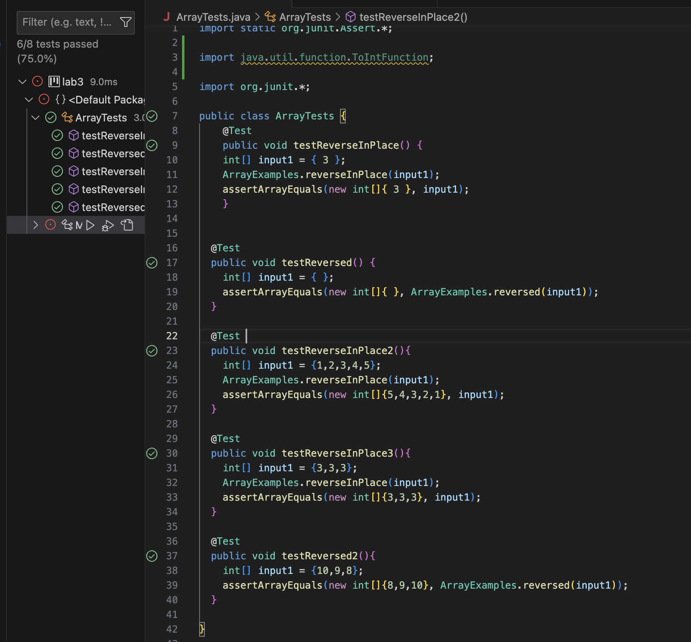

# Lab Report #5: Debugging and Reflection 
This lab report will be tackling a debugging scenario and then reflecting on the Spring Quarter lab experience! 

## Debugging Scenario

### Student Post: 
 
<br>


### Screenshots of Errors and Symptoms:

**The Method**
 
<br>


**J Unit Tests**
 
<br>


**J Unit Test Error Message**
 
<br>

**Compile Commands from Terminal**

From ArrayExamples.java
 
<br>


### Student's Post Breakdown 

From the student's post it can be found that: 

**The symptom** is a type mismatch where the code cannot convert from double[] to int[].

**The bug** appears to be from line 30, the return statement.

**Failure - Inducing Inputs** are from the JUnit tests: testReversed and testReversed2. Moreover, 
the command < javac ArrayExamples.java > .

<br>


### TA Response:
  
  It appears to me that you are right on your bug coming from a type mismatch by trying to 
  convert a double array into a type integer array. In your method header, you declared that you 
  will return an array of type int[]. However, in line 22 of your method, you have created a double array.
  To fix this bug, try making this array into an integer type instead of a double. Afterwards, compile your code
  and run tests to see if this bug has now been fixed! 
  <br>
  
 
### Student's Debugging 
  
  The student's debugging of the suggested line 22 can be seen here: 
   
  <br>
  
  **The outputs after debugging can be seen here:**
  
  **Compile Success -** After fixing the method line and running the command < javac ArrayTests.java > , 
  it is successful as no error message is outputted. 
   
  <br>
  
  **JUnit Tests Passes -** The student's test cases have now passed without the type error message 
  appearing in the test cases: testReversed and testReversed2.
   
  <br>
  
  **Bug Description**
  - The bug was a type mismatch where the method required an int[] type to be returned on line 30. However, the method
  body created a double[]. This means that the method then does not return an int[] because of the double[]
  that was created in line 22. Thus, there is a conversion error between the types as the method is specific to returning
  an int[]. 
  
 
### Set Up Information
  
  **File & Directory Structure**
  - The file structure needed to setup the code are two java files, ArrayTests.java and ArrayExamples.java.
    - ArrayExamples.java contains the methods to reverse the arrays.
    - ArrayTests.java contains examples of arrays to be tested to determine if the methods reverse the array as expected.
  - The directory is used from .../GitHub/lab3
  
  **File Contents (prior to debug)**
  - Method of Bug from ArrayExamples.java 
    
  <br>
  
  
  - Test Cases 
     
  <br>
  
  
  **Command Lines (triggering bug)**
  - Running JUnit triggerd in VS Code 
  - < javac ArrayExamples.java > 
 
  
  **Debugging Solution**
  - To fix the bug, the method's line 22 in the file ArrayExamples.java needed the array types to change from double[] into int[] 
  
  The Error:
  
  ```
  double[] newArray = new double[arr.length];
  ```
  
  Fixing the Error:
  ```
  int[] newArray = new int[arr.length];
  ```

## Reflection 

  In the second half of this quarter, I found the VIM tool to be very interesting as each key on the keyboard corresponds
  to a command that can help you efficiently edit your code. I learned that VIM commands can customizable, 
  which allows me to adapt my method of coding in an effective, structured style. For example the commands to delete like
  < dw >, delete a word, and < dd >, delete a whole line, can be customized. 
  
  This customization can be seen here:
  
  **Command < dw >**
  
  < d6w > 
  - This command means delete 6 words. 
  
  **Command < dd >**
  
  < 4dd >
  - This command means delete 4 lines. 
  
  
