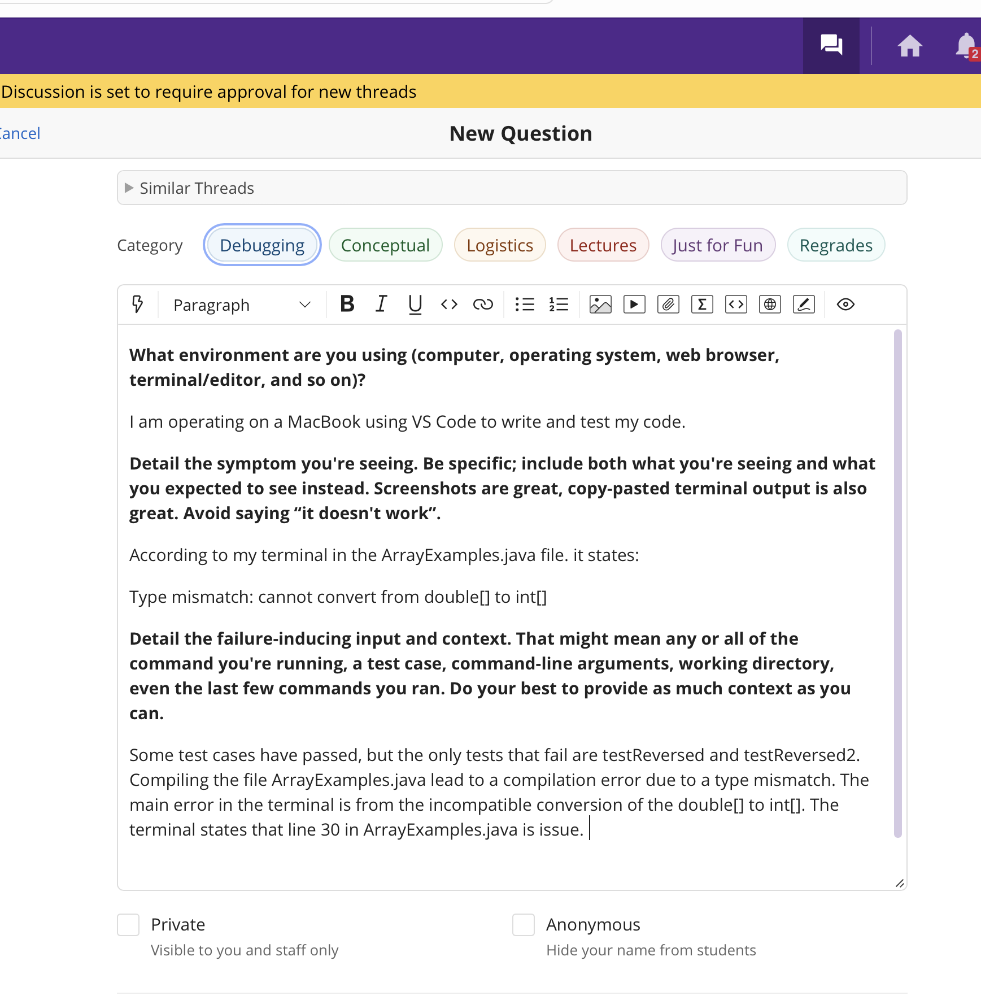
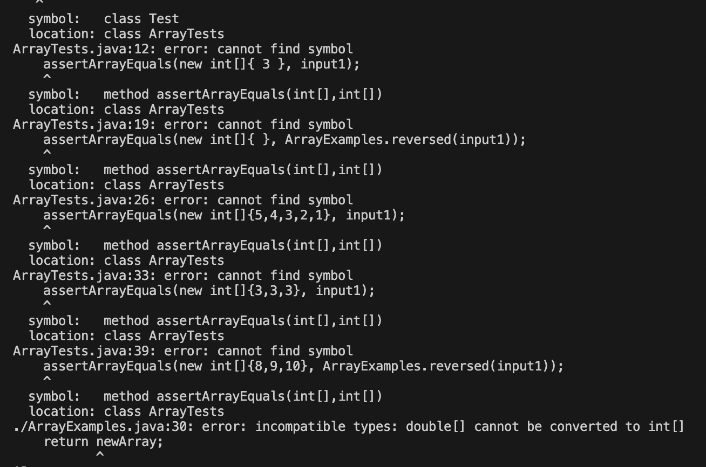

# Lab Report #5: Debugging and Reflection 
This lab report will be tackling a debugging scenario and then reflecting on the Spring Quarter lab experience! 

## Debugging Scenario

### Student Post: 
 
 

### Screenshots of Errors and Symptoms:

**The Method**
 
 

**J Unit Tests**
 
 

**J Unit Test Error Message**
 
 

**Compile Commands from Terminal**

From ArrayTests.java
 

From ArrayExamples.java
 
 

### Student's Post Breakdown 

From the student's post it can be found that: 

**The symptom** is a type mismatch where the code cannot convert from double[] to int[].

**The bug** appears to be from line 30, the return statement.

**Failure - Inducing Inputs** are from the JUnit tests: testReversed and testReversed2. Moreover, 
the commands < javac ArrayTests.java > and < javac ArrayExamples.java > .

 

### TA Response:
  
  It appears to me that you are right on your bug coming from a type mismatch by trying to 
  convert a double array into a type integer array. In your method header, you declared that you 
  will return an array of type int[]. However, in line 22 of your method, you have created a double array.
  To fix this bug, try making this array into an integer type instead of a double. Afterwards, compile your code
  and run tests to see if this bug has now been fixed! 
   
  
  
  ### Student's Debugging 
  
  
  
  
  
  
  **Bug Description**
  
  
  
  ### Set Up Information
  
  **File & Directory Structure**
  
  **File Contents (prior to debug)**
  
  **Command Lines (triggering bug)**
  
  **Debugging Solution**
  
  
  
  

## Reflection 

  In the second half of this quarter, I found the VIM tool to be very interesting as each key on the keyboard corresponds
  to a command that can help you efficiently edit your code. I learned that VIM commands can customizable, 
  which allows me to adapt my method of coding in an effective, structured style. For example the commands to delete like
  < dw >, delete a word, and < dd >, delete a whole line, can be customized. 
  
  This customization can be seen here:
  
  **Command < dw >**
  
  < d6w > 
  - This command means delete 6 words. 
  
  **Command < dd >**
  
  < 4dd >
  - This command means delete 4 lines. 
  
  
